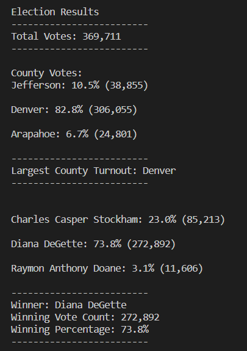

# Election_Analysis

## Overview of Election Audit

The Colorado election commission requests an election audit of a local election.  This election audit analysis is to provide the commission the results:

- Total number of votes cast
- The voter turnout for each county
- The percentage of votes from each county out of the total count
- The county with the highest turnout
- Candidates' votes and percentage
- Winning candidate name, votes and percentage

## Election-Audit Results

The election results are shown in the following bullet list:

- *<u>Total number of votes cast</u>*   

  **369,711**

- *<u>The number of votes and the percentage of total votes for each county in the precinct</u>*

  **County Votes:**
  **Jefferson: 	10.5% 	(38,855)**
  **Denver: 		82.8% 	(306,055)**
  **Arapahoe: 	6.7% 	 (4,801)**

- *<u>County had the largest number of votes</u>*

  **Denver**

- *<u>The number of votes and the percentage of the total votes each candidate received</u>*

  **Charles Casper Stockham: 	23.0%	 (85,213)**
  **Diana DeGette: 						73.8% 	(272,892)**
  **Raymon Anthony Doane: 		3.1% 	(11,606)**

- *<u>The Winning candidate, their vote count, and percentage of the total votes</u>*

  **Winner: 							Diana DeGette**
  **Winning Vote Count: 	272,892**
  **Winning Percentage: 	73.8%**

The printed output of these results are shown here:

​							

## **Election-Audit Summary** 

This python code is used to analyze a local election and provide the results to the Colorado election commission.  This code can be possibly used for any election with some modifications. 

1. ##### The data file

   In the code, the data file was read from a fixed file name,

   `file_to_load = os.path.join( "Resources", "election_results.csv")`.

   We can change it for a user to type in the data file, so that we can use it for any files.

   `file_to_load = input("Please enter the election data file: ")`.

2. ##### The row number

   In the code, the candidate and the county are at the 3rd and 2nd position.
   
       `candidate_name = row[2]`
       `county_name = row[1]`

   For other elections, we need to examine the position of candidate and county and modify the code accordingly to read the correct names.
